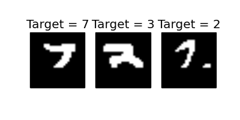

# MNIST Inpainting
Adam Hornsby

This repository contains all code, model files, visualisations and reports for my experiments with RNNs in TensorFlow. I used recurrent neural networks to classify and predict the next pixel of MNIST images.

### Folder structure
This repository contains the following folders:

1. code - This contains all .py files necessary for training, evaluating and loading models
2. visualisations - This contains animated GIFs of the MNIST images being completed by 4 different Gated Recurrent Unit models (GRUs)
<!-- 2. output - This contains all model files and learning curve visualisations -->
<!-- 3. report - This contains all LaTeX files necessary to create the final report for this project -->

<!-- ### Loading models and validating performance
You can import all models reported in this repository by running the load_models.py file within the code folder. To use this script, simply type 'python load_models.py exercise_number' where exercise_number is either 1 or 2 depending on whether you want to load the digit or pixel classifiers, respectively. All models will be loaded and then validated on the training and test sets. All values should match up with those shown in the report.
 -->
### Model development files
Files used to train models, generate visualisations and evaluate models are available in the code folder (except the load_models.py file). The run_lstm.py file is the main code used to train both sets of RNN models. The run_generator.py file is the main code used to in-paint images described in section 2 and 3 of this coursework.

